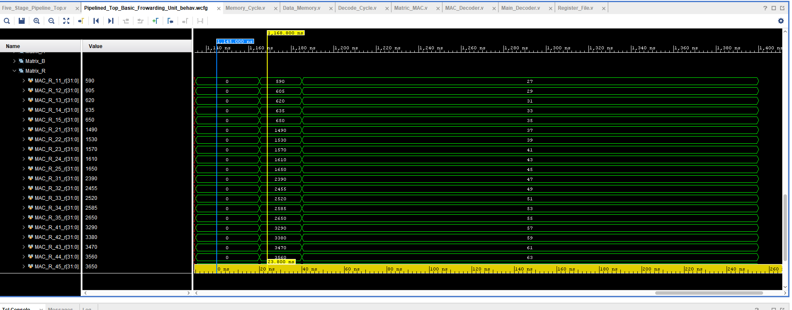
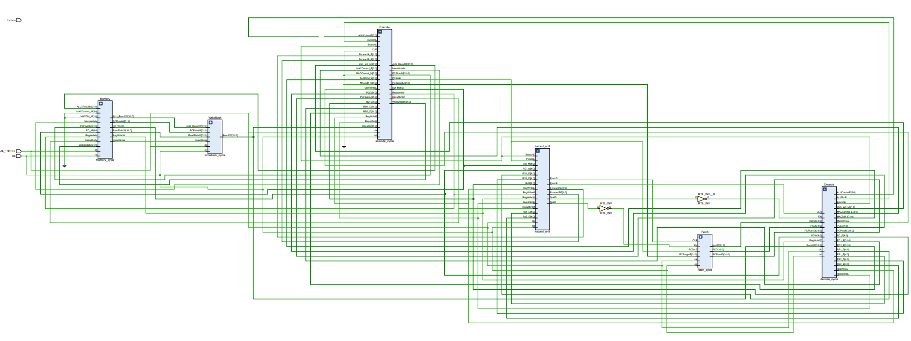

# RISC-V Project

## Complete RISC V Matrix MAC Processor

In this section, you'll find the details of the RISC V Matrix MAC Processor implementation and its instruction set architecture (ISA).

### Results

<!--
-->
<!--  -->
<!--   -->
<!--
-->

### Schematics

### Instruction Set Architecture (ISA - Default)

| Instruction | ALU Control | Opcode | Funct3 | Funct7 | Type   | Tested | Test Cases                   |
|-------------|-------|---------|--------|--------|--------|--------|-------------------------------    |
| ADD         | 00000 | 0110011 | 000    | 0000000| R-type | YES    | add x3, x1, x2                      |
| SUB         | 00001 | 0110011 | 000    | 0100000| R-type | YES    | sub x4, x1, x2  sub x5,x2,x1     |
| MUL         | 00010 | 0110011 | 000    | 0000001| R-type | YES    | mul x6, x1, x2     |
| AND         | 00011 | 0110011 | 111    | 0000000| R-type | YES    | and x6, x1, x2                      |
| XOR         | 00101 | 0110011 | 100    | 0000000| R-type | YES    | xor x10, x1, x2                          |
| OR          | 00100 | 0110011 | 110    | 0000000| R-type | YES    | or x7, x1, x2                       |
| SLT         | 01100 | 0110011 | 010    | 0000000| R-type | YES    | slt x11, x2, x1                         |
| LW          |  N/A  | 0000011 | 010    | N/A    | I-type | YES    | lw x25 -11(x31) lw x12,  8(x10)|
| LI          |  N/A  | 0010011 | 000    | N/A    | I-type | YES    | li x2, -2  li x10, 400         |
| ADDi        |  N/A  | 0010011 | 000    | N/A    | I-type | YES    | addi x1, x0, 15                   |
| SLLI        | 00110 | 0010011 | 001    | 0000000| I-type | YES    | slli x12, x1, 3 |
| SRLI        | 00111 | 0010011 | 101    | 0000000| I-type | YES    |srli x13, x2, 3       |
| SW          |  N/A  | 0100011 | 010    | N/A    | S-type | YES    | sw x6, -3(x31) sw x4,  8(x10)  |
| BGE         | 01000 | 1100011 | 101    | N/A    | B-type | YES    | bge x2, x1, -56                       |
| BEQ         | 01001 | 1100011 | 000    | N/A    | B-type | YES    | beq x1, x1, 56                           |
| BNE         | 01010 | 1100011 | 001    | N/A    | B-type | YES    |bne x2, x1, 12                          |
| BLT         | 01011 | 1100011 | 100    | N/A    | B-type | YES    | blt x2, x1, test2                          |

### Instruction Set Architecture ( ISA - Updated - NEW )
| Instruction | MAC Control | Opcode  | Funct3 | MAC_OP | Type   | Tested | Test Case    |
|-------------|-------------|---------|--------|--------|--------|--------|--------------|
| LMAC A      | 0000        | 1110111 | 000    | 00     | M-Type |  YES   | LMACA 400, 5 |
| LMAC B      | 0001        | 1110111 | 001    | 00     | M-Type |  YES   | LMACA 425, 5 |
| CLR A       | 0010        | 1110111 | 000    | 01     | M-Type |  YES   | CLR A        |
| CLR B       | 0011        | 1110111 | 001    | 01     | M-Type |  YES   | CLR B        |
| CLR R       | 0100        | 1110111 | 010    | 01     | M-Type |  YES   | CLR R        |
| CLR All     | 0101        | 1110111 | 011    | 01     | M-Type |  YES   | CLR ALL      |
| MACM        | 0110        | 1110111 | 000    | 10     | M-Type |  YES   | MAC M        |
| MAC Add     | 0111        | 1110111 | 001    | 10     | M-Type |  YES   | MAC ADD      |
| MAC Sub     | 1000        | 1110111 | 010    | 10     | M-Type |  YES   | MAC SUB      |
| SUB MAC     | 1001        | 1110111 | 011    | 10     | M-Type |  YES   | SUB MAC      |
| STR R       | 1010        | 1110111 | 000    | 11     | M-Type |  YES   | STR R        |

### Instructions on how to Use the Processor:

<pre>
    <ol>
<li>    git clone "https://github.com/theuppercaseguy/FYP--Risc-V-32-bit-Matrix-Mac"
    cd "Project/RISC_V_MAC_Processor/"
    
    Note: update the Instruction Memory in the "Instruction _memory.v" file
</li>
<li>    Run behavioriual Simulation</li>
<li>    In TCL Console, Type "run 400". To increase the timeline and to execute the remaining instructions.</li></ol>
</pre>

## [Instruction Memory File](../../Project/RISC_V_MAC_Processor/RISC_V_MAC_Processor.srcs/sources_1/imports/new/Instruction_Memory.v) : (Successfully) Tested Code
| ASSEMBLY-CODE | HEX-CODE |
|-----------------------|------------|
li   x1, 1	|0x00100093
li   x2, 2|	0x00200113
li   x3, 3	|0x00300193
li   x4, 4	|0x00400213
li   x5, 5	|0x00500293
li   x6, 6	|0x00600313
li   x7, 7	|0x00700393
li   x8, 8	|0x00800413
li   x9, 9	|0x00900493
li   x10, 10|	0x00A00513
li   x11, 11|	0x00B00593
li   x12, 12|	0x00C00613
li   x13, 13|	0x00D00693
li   x14, 14|	0x00E00713
li   x15, 15|	0x00F00793
li   x16, 16|	0x01000813
li   x17, 17|	0x01100893
li   x18, 18|	0x01200913
li   x19, 19|	0x01300993
li   x20, 20|	0x01400A13
li   x21, 21|	0x01500A93
li   x22, 22|	0x01600B13
li   x23, 23|	0x01700B93
li   x24, 24|	0x01800C13
li   x25, 25|	0x01900C93
sw   x1, 400(x0)|	0x18102823
sw   x2, 401(x0)|	0x182028A3
sw   x3, 402(x0)|	0x18302923
sw   x4, 403(x0)|	0x184029A3
sw   x5, 404(x0)|	0x18502A23
sw   x6, 405(x0)|	0x18602AA3
sw   x7, 406(x0)|	0x18702B23
sw   x8, 407(x0)|	0x18802BA3
sw   x9, 408(x0)|	0x18902C23
sw   x10,409(x0)|	0x18A02CA3
sw   x11, 410(x0)|	0x18B02D23
sw   x12, 411(x0)|	0x18C02DA3
sw   x13, 412(x0)|	0x18D02E23
sw   x14, 413(x0)|	0x18E02EA3
sw   x15, 414(x0)|	0x18F02F23
sw   x16, 415(x0)|	0x19002FA3
sw   x17, 416(x0)|	0x1B102023
sw   x18, 417(x0)|	0x1B2020A3
sw   x19, 418(x0)|	0x1B302123
sw   x20, 419(x0)|	0x1B4021A3
sw   x21, 420(x0)|	0x1B502223
sw   x22, 421(x0)|	0x1B6022A3
sw   x23, 422(x0)|	0x1B702323
sw   x24, 423(x0)|	0x1B8023A3
sw   x25, 424(x0)|	0x1B902423
li   x1, 26	|0x01A00093
li   x2, 27	|0x01B00113
li   x3, 28|	0x01C00193
li   x4, 29|	0x01D00213
li   x5, 30|	0x01E00293
li   x6, 31|	0x01F00313
li   x7, 32|	0x02000393
li   x8, 33|	0x02100413
li   x9, 34|	0x02200493
li   x10, 35|	0x02300513
li   x11, 36|	0x02400593
li   x12, 37|	0x02500613
li   x13, 38|	0x02600693
li   x14, 39|	0x02700713
li   x15, 40|	0x02800793
li   x16, 41|	0x02900813
li   x17, 42|	0x02A00893
li   x18, 43|	0x02B00913
li   x19, 44|	0x02C00993
li   x20, 45|	0x02D00A13
li   x21, 46|	0x02E00A93
li   x22, 47|	0x02F00B13
li   x23, 48|	0x03000B93
li   x24, 49|	0x03100C13
li   x25, 50|	0x03200C93
sw   x1, 425(x0)|	0x1A1024A3
sw   x2, 426(x0)|	0x1A202523
sw   x3, 427(x0)|	0x1A3025A3
sw   x4, 428(x0)|	0x1A402623
sw   x5, 429(x0)|	0x1A5026A3
sw   x6, 430(x0)|	0x1A602723
sw   x7, 431(x0)|	0x1A7027A3
sw   x8, 432(x0)|	0x1A802823
sw   x9, 433(x0)|	0x1A9028A3
sw   x10,434(x0)|	0x1AA02923
sw   x11, 435(x0)|	0x1AB029A3
sw   x12, 436(x0)|	0x1AC02A23
sw   x13, 437(x0)|	0x1AD02AA3
sw   x14, 438(x0)|	0x1AE02B23
sw   x15, 439(x0)|	0x1AF02BA3
sw   x16, 440(x0)|	0x1B002C23
sw   x17, 441(x0)|	0x1B102CA3
sw   x18, 442(x0)|	0x1B202D23
sw   x19, 443(x0)|	0x1B302DA3
sw   x20, 444(x0)|	0x1B402E23
sw   x21, 445(x0)|	0x1B502EA3
sw   x22, 446(x0)|	0x1B602F23
sw   x23, 447(x0)|	0x1B702FA3
sw   x24, 448(x0)|	0x1D802023
sw   x25, 449(x0)	0x1D9020A3
ecall	|0x00000073

